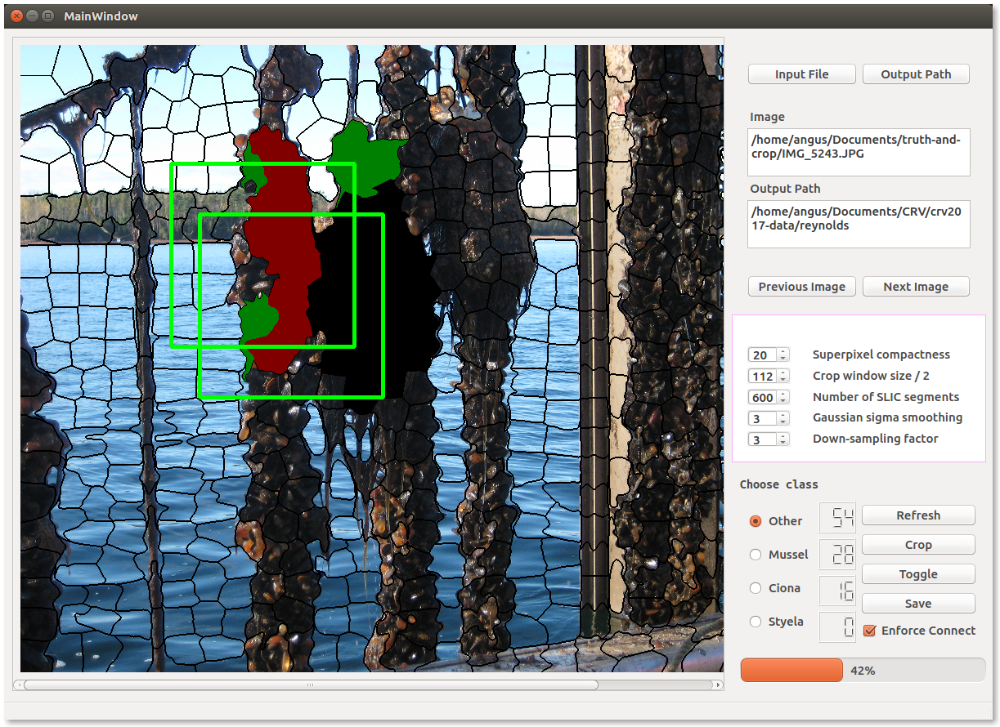

# truth-and-crop

Convient GUI application for quickly ground-truthing semantic segmentation datasets in Python/OpenCV.



### Dependencies

+ `python 3.4`
+ `pyqt 4.x`
+ `opencv 3.x`
+ `numpy 1.11`
+ `colorama 0.3`
+ `scikit-image 0.12`

To install PyQt4 with Anaconda, `conda install pyqt=4`

### Usage

```bash
python truth_and_crop.py
```

### Buttons

+ __Input File__ - Browse to image file to load.
+ __Output Path__ - Browse to root folder where output should be saved. Three subfolders are automatically created here.
+ __Previous/Next Image__ - If other images were found in same folder as Input File, you can jump between images with these buttons.
+ __Refresh__ - Discards changes.
+ __Crop__ - Switch between annotation mode and cropping mode.
+ __Toggle__ - Toggle annotations on and off to make it easier to see raw image. SLIC is only run on the image for the first toggle, subsequent toggles are much faster.
+ __Save__ - To write all cropped images and masks into appropriate subfolders under the path specified by 'Output Path'.
